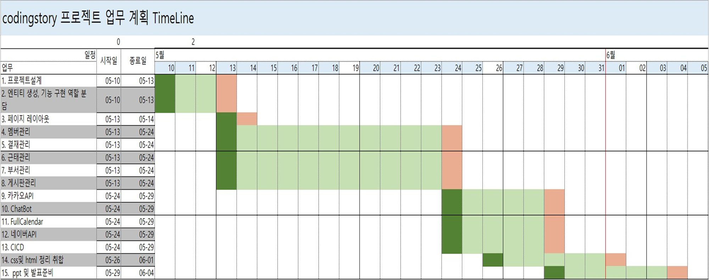

# 😝codingStory

## 🔍전체 목차  
- [개요](#개요) 
- [주요 기능](#-주요-기능-) 
- [프로젝트 상세](#-프로젝트-상세) 

2차 프로젝트 기본설정

프로젝트명 : codingStory

프로그래밍 언어 : JAVA

프레임워크 : Springboot 2.7.11

라이브러리 DI : Spring WEB(MVC), Thymeleaf, Spring Data JPA, Lombok, SpringSecurity5
, websocket, validation, OAuth2, security

데이터베이스 : MySql8

ORM : Spring Data JPA (JAVA(SQL))

개발툴 : IntelliJ

템플릿 엔진 : Thymeleaf (HTML + Data)

빌드 : Gradle

설정 : application.yml, application-oauth2.yml(google,naver,kakao api 키 필요)

기타 설정: 
1. setting - gradle 
  
2. project Structure - SDK -> 11  
     

##  📌 프로젝트 Git 다운로드 주소 📌
$git clone https://github.com/Sim-Ji-Seob/Project2_CodingStory.git  
branch : master

# 📝프로젝트 개요📝
## 🗓️일정
  

## 📝개요

프로젝트 개요

2차 프로젝트는 3차 프로젝트의 OPEN API를 연계하여 사용하기 위해 영화관으로 테마를 정했습니다. 
영화관에 근무하는 근무자들이 사용할 수 있는 관리자 페이지를 만들었고, 각종 기능들을 추가하였습니다. 
그 중 저는 근무자들이 보고서를 작성하고 결재를 받을 수 있게 하는 시스템을 만들었습니다. 

 

## 🖱️개발 환경🖱️
### 💻 프로그램 💻  

### 🛠 개발 환경 🛠  

  

# ⚡ 팀원별 역할 ⚡
- [ ] 이** (팀장) : DB설계, 게시판 관리, 카카오 API , 영화 API, layout css
- [ ] 박** (팀원) : 회원 CRUD, OAuth2 , Security , CI/CD
- [x] _**심지섭 (팀원) : 문서 CRUD, 문서 결재관리 , Chat-Bot**_
- [ ] 왕** (팀원) : 출퇴근 관리 , 네이버 API , 급여 관리
- [ ] 조** (팀원) : 부서관리, FullCalender

#  🚀 주요 기능 🚀

| 기능      | 설명                                                                       | 
|---------|--------------------------------------------------------------------------|
| 보고서 작성  | 보고서 작성  보고서 종류 선택(업무/회의/결재/휴가 보고서 )                                |
| 보고서 수정  | 보고서의 종류와 제목 등 데이터 수정                                                 |
| 보고서 삭제  | 본인글만 삭제 가능                                                               |
| ⭐보고서 상신  | 자신이 결재자인 보고서의 상태 변경가능(대기중/승인/반려)  결재자가 코멘트를 남기면 저장되어 보고서 작성자가 볼 수 있다. |
| Chat-Bot | 채팅창에 회원의 이름과 정보를 입력하면   DB에서 데이터를 불러와 채팅창에 출력                         |
                                     

# 📁 프로젝트 상세
### 목차
1. [보고서 작성](#보고서-문서-작성-후-결재자-설정br)
2. [보고서 상세보기, 결재](#-보고서-상신상세보기-페이지)
3. [보고서 목록](#-보고서-리스트-페이지)
4. [Index 페이지](#-index-main-페이지입니다)
5. [Chat-Bot](#-chat-bot-페이지입니다)

#  1️⃣ 보고서 문서 작성 후 결재자 설정   
## ● 보고서 작성 페이지

●↓ 작성자는 보고서 작성시 결재자를 선택할 수 있습니다. 선택할 때 동명이인을 구분하고 가독성을 높이기 위해 부서와 직급, 이름이 모두 보이도록 코드를 작성했습니다. 
    결재자의 정보는 데이터베이스에 저장된 회원들의 정보를 불러와 select option 으로 불러왔습니다.    
보고서의 상태는 '대기중'이 기본값으로 들어가도록 설정했습니다. 
  

### ● 보고서의 종류
 

### ● 부서 선택
부서는 관리자가 추가로 만들 수 있게 설계되어있습니다. 해당 부서들은 DB에서 데이터를 가져오는 것이기 때문에 부서가 추가된다면 해당 selectbox에도 자동으로 추가됩니다. 
 

### ● 결재 기한 설정
 

### ● 다른 데이터 베이스와 연관관계
 

 

#  2️⃣ ⭐보고서 상신, 결재 및 상세보기 ※
### ● 보고서 상신(상세보기) 페이지
 
 
상태의 값을 설정하여 상신을 누르게 되면 보고서의 상태값이 변화되어 저장됩니다. 
 

아래 사진은 결재자가 상태를 변경한 후 작성자가 확인한 보고서입니다.  
결재 상신을 할 때 코멘트를 남길 수 있도록 textarea를 만들었으며, 작성 후 상신하면 코멘트 데이터가 저장되어 보고서 작성자에게 보이게 됩니다.
 

### ● 보고서 수정 및 삭제

#  3️ 보고서 목록 
### ● 보고서 리스트 페이지
보낸,반려된,결재 대기중,반려한, 전체 문서의 카테고리들을 나누어 페이지를 만들었는데 이동을 편리하게 하기 위해 상단에 버튼을 만들었습니다.
리스트에서는 사진과 같이 필요하다고 생각하는 데이터를 보여지게 하였습니다.
 

# 4️⃣ Index 
### ● Index Main 페이지입니다.
로그인을 하면 본인에게 온 보고서가 있는지 한 눈에 파악하기 쉽도록 숫자로 표현하였습니다.
a태그를 통해 이동을 할 수 있도록 작성했습니다.
 
 

# 5️⃣ Chat-Bot
### ● Chat-Bot 페이지입니다.
사이드바 메뉴를 통해 '상담'을 클릭하면 Chat-Bot 페이지로 이동하게 됩니다.
해당 페이지의 좌측에는 자주하는 질문을 클릭하면 내려오는 드롭바 형식으로 만들었습니다.
 
 

 
우측의 상담문의 버튼을 누르면 Chat-bot 창이 뜨게 됩니다.
알고 싶은 회원의 이름과 정보를 검색하면 DB에서 정보를 가져와 사진처럼 출력을 합니다.
 
 

● Chat-Bot 영상 

[⬆⬆맨위로⬆⬆](#codingstory) 
